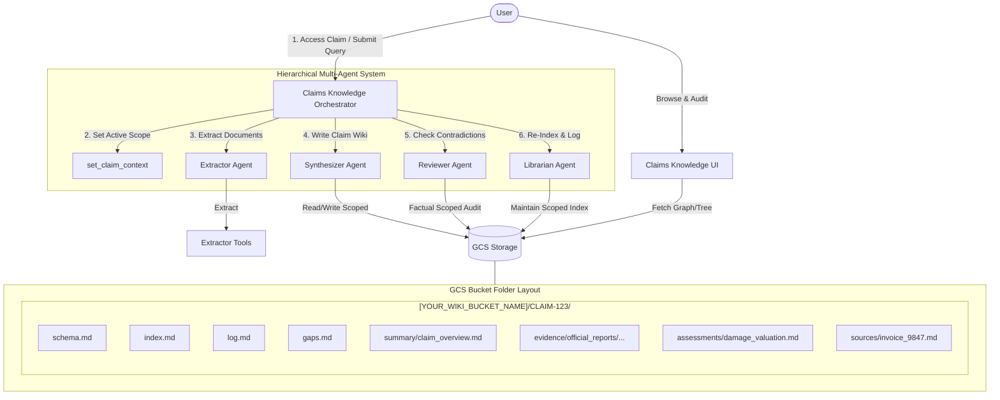
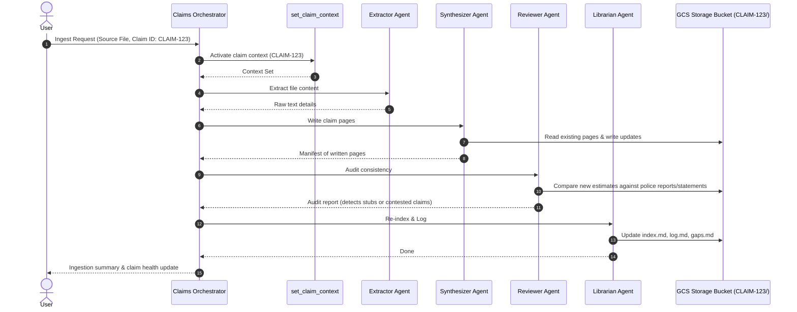
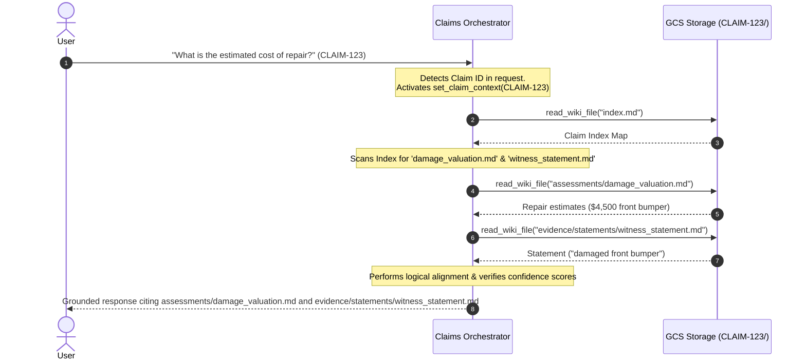

# Claims Knowledge Agent

This project implements an ADK-based intelligent claims processing system that builds and maintains a persistent, compounding knowledge base (wiki) for individual insurance claims in Google Cloud Storage (GCS). By leveraging the "Active Knowledge Agent Wiki" pattern, the system avoids traditional, fuzzy vector-based RAG (Retrieval-Augmented Generation) in favor of structured, interlinked markdown files isolated per `claim_id`. Guided by a centralized claims schema and index, it captures highly precise, auditable relationships (e.g., damage estimates supporting witness descriptions).

It also features a rich, dark Web UI (`claims-knowledge-ui`) with a secure Claim Selection entry portal and an interactive Obsidian-style graph view.

## Core Concept

Unlike traditional RAG systems that retrieve raw, contextless text chunks at query time, the Claims Knowledge Agent:
1.  **Isolates Claims**: Dynamically scopes all data, evidence, assessments, and logs under a secure folder structure: `[YOUR_WIKI_BUCKET_NAME]/<claim_id>/`.
2.  **Incrementally Builds Claim Context**: Synthesizes incoming raw documents (police reports, medical transcripts, mechanic estimates) into cross-referenced markdown files.
3.  **Captures Explicit Ontological Relationships**: Connects claims pages together (e.g. linking a damage estimate to a police report using `supports`, or witness statements using `contradicts`) in page frontmatter.
4.  **Assigns Confidence Scores**: Measures data reliability (e.g. 1.0 for official reports, 0.6 for claimant assertions) directly in the page structure.
5.  **Maintains a Zero-Vector Index**: Navigates the claim's knowledge graph using `index.md` instead of complex, black-box vector databases, making the agent's memory 100% transparent and human-editable.

---

## Architecture & Design

The system consists of four main layers:
-   **Raw Sources**: Immutable claims files, PDFs, or URLs uploaded during ingestion.
-   **The Scoped Claim Wikis**: Compounding markdown files stored in GCS under the bucket `[YOUR_WIKI_BUCKET_NAME]`.
-   **The Claims Schema**: `schema.md` defining the directory structure, confidence criteria, and relationship ontology.
-   **The Web UI**: A Next.js application featuring:
    -   **Claim Access Entry Screen**: Restricts access to a single Claim ID context.
    -   **Dynamic Tree View Sidebar**: Shows claim folder structures (`summary/`, `evidence/`, `assessments/`, `settlement/`, `sources/`).
    -   **Interactive Graph View**: Visualizes explicit connections and highlights contradicted or contested claims with warning icons.

---

### Multi-Agent Architecture Design

The backend is powered by a **hierarchical multi-agent orchestration system** built on the Google Agent Development Kit (ADK). Rather than a single agent attempting to execute all reasoning and GCS editing sequentially, tasks are delegated to specialized, autonomous sub-agents collaborating under a central orchestrator.

- **Claims Knowledge Orchestrator** ([agent.py](file:///Users/sgardezi/work/projects/knowldege-agent-claim-adk/app/agent.py)): The root agent. It enforces the initial `claim_id` verification. If a Claim ID is detected, it calls `set_claim_context` to dynamically scope GCS tools, then routes ingestion, query, or auditing tasks to sub-agents.
- **Extractor Agent** ([extractor_agent.py](file:///Users/sgardezi/work/projects/knowldege-agent-claim-adk/app/agents/extractor_agent.py)): A single-responsibility agent that extracts text content from raw uploaded invoices, doctor notes, transcripts, and PDFs.
- **Synthesizer Agent** ([synthesizer_agent.py](file:///Users/sgardezi/work/projects/knowldege-agent-claim-adk/app/agents/synthesizer_agent.py)): The core writer. It parses extracted source text, extracts claim entities, generates formatted claim wiki pages in GCS, and maps frontmatter relationship linkages.
- **Reviewer Agent** ([reviewer_agent.py](file:///Users/sgardezi/work/projects/knowldege-agent-claim-adk/app/agents/reviewer_agent.py)): An independent auditor. It scans changed claim pages for schema compliance, checks for factual contradictions, and flags pages as `contested` if conflicting claims are discovered.
- **Librarian Agent** ([librarian_agent.py](file:///Users/sgardezi/work/projects/knowldege-agent-claim-adk/app/agents/librarian_agent.py)): A bookkeeper. It maintains the claim's `index.md`, compiles chronological entries in `log.md`, and tracks pending stubs (missing information gaps) in `gaps.md`.
- **Schema Manager Agent** ([schema_manager_agent.py](file:///Users/sgardezi/work/projects/knowldege-agent-claim-adk/app/agents/schema_manager_agent.py)): Manages claim directory structures and merges approved schema templates.

---

### Multi-Agent Topology



---

### Core Multi-Agent Workflows

#### 1. Document Ingestion Pipeline
When an adjuster or claimant submits a new document (e.g., an auto repair quote):



#### 2. Grounded Q&A Pipeline
When a user queries a claim (e.g., "What is the current estimated cost of repair, and does it match the witness statement?"):



---

## Project Structure

```
claims-knowledge-agent/
├── app/
│   ├── __init__.py
│   ├── agent.py             # Claims Knowledge Orchestrator and application
│   ├── agent_runtime_app.py # Agent Runtime entrypoint
│   ├── agents/              # Specialized sub-agents
│   │   ├── extractor_agent.py
│   │   ├── synthesizer_agent.py
│   │   ├── reviewer_agent.py
│   │   ├── librarian_agent.py
│   │   └── schema_manager_agent.py
│   └── tools/
│       ├── claim_context.py # [NEW] Scopes active session state to a claim ID
│       ├── gcs_io.py        # Dynamic folder-scoping cloud I/O tools
│       ├── extractor.py     # Content extraction tools
│       └── health.py        # Quantitative claims wiki health calculators
├── frontend/                # Claims Knowledge UI (Next.js app)
│   ├── app/
│   │   ├── page.tsx         # [MODIFIED] Claims selection portal and workspace
│   │   └── api/wiki/        # [MODIFIED] API routes supporting dynamic claimId query
│   └── components/          # Dynamic, isolated render components (Graph, Sidebar, etc.)
├── pyproject.toml           # Configuration manifest
├── schema.md                # Compounding Claims Wiki Schema definition
└── README.md                # This file
```

---

## Getting Started

### Prerequisites
-   `uv` package manager installed.
-   `agents-cli` installed (`uv tool install google-agents-cli`).
-   Google Cloud SDK authenticated and authorized.

### Environment Configuration
Create a `.env` file in the project root and a `.env` file in `frontend/` referencing the active claims wiki storage bucket:
```env
WIKI_BUCKET_NAME=[YOUR_WIKI_BUCKET_NAME]
```

### Installation
```bash
agents-cli install
```

### Local Development (Agent)
Run local playground mode to interact with the Claims Knowledge Orchestrator:
```bash
agents-cli playground
```
*Note: The agent will immediately ask you for a Claim ID. Provide one (e.g., `CLAIM-101`) to begin interacting and building/inspecting the scoped GCS wiki.*
