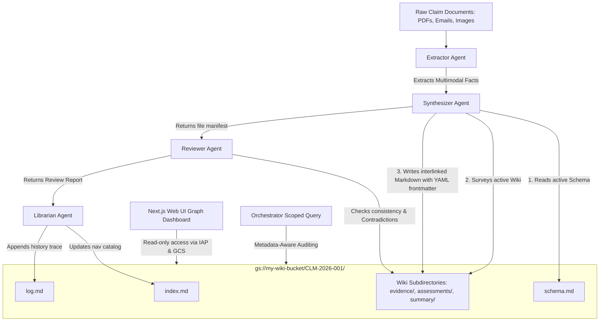
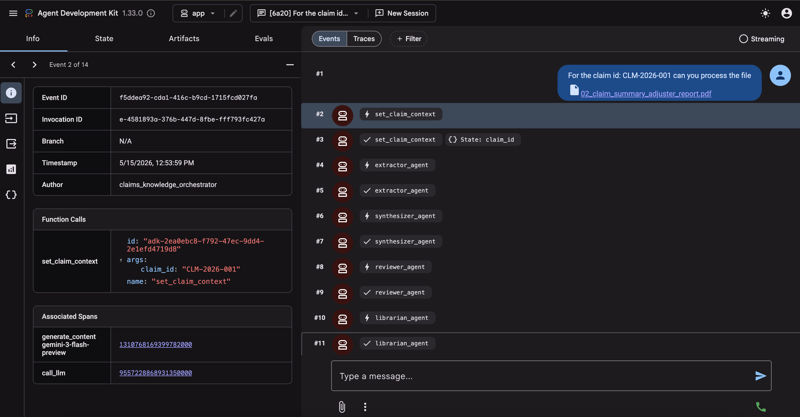
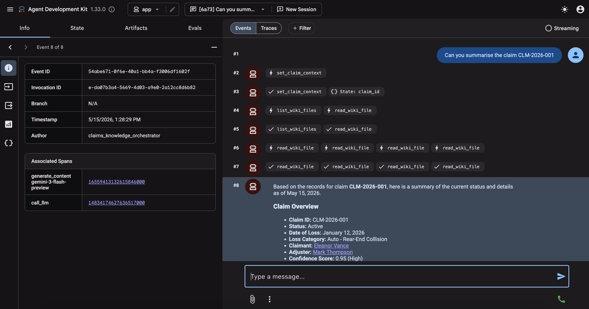
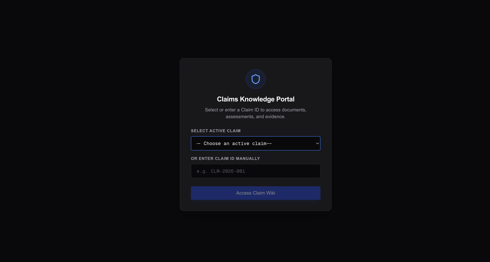
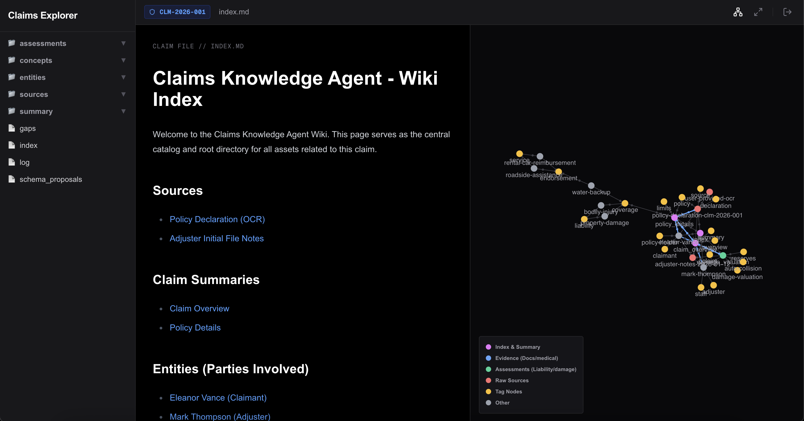

# Evolving Claims: Why the Active Knowledge Wiki Pattern Outperforms Traditional RAG for Evolving Complex Domains

*Author: Syed Gardezi sgardezi@google.com*
*Date: May 2026*

---

## Abstract

In industries like insurance, healthcare, and legal tech, data is rarely static. An insurance claim is a living, temporal story. Over weeks or months, a single claim evolves from a simple **Policy Declaration** and **First Notice of Loss** into a complex web of **witness statements, adjuster notes, police records, repair invoices, medical assessments,** and **settlement negotiations**. 

When organizations attempt to build AI decision-support systems for these domains, they almost always reach for **Retrieval-Augmented Generation (RAG)** using Vector Databases. However, for temporal, state-driven data, traditional RAG quickly falls flat, leading to conflicting citations, chronological blindness, and dangerous hallucinations.

This blog post introduces a superior alternative: the **Active Knowledge Wiki Pattern**. Developed using the **Google Agent Development Kit (ADK)**, deployed on **Vertex AI Agent Platform**, and visualized via an interactive **Next.js graph dashboard**, this pattern replaces black-box vector searches with a self-organizing, persistent, and human-auditable Knowledge Wiki stored in Google Cloud Storage (GCS).

---

## The Temporal Failure of Traditional RAG

To understand why the Active Knowledge Wiki is a major step forward, we must first diagnose why traditional vector-based RAG fails in complex, evolving domains.

Traditional RAG works by chunking documents, generating high-dimensional vector embeddings, and storing them in a Vector Database (like Vertex AI Vector Search or pgvector). When a user asks a query, the system retrieves the top-$K$ most semantically similar chunks.

For a static dataset (e.g., a company's policy handbook), this works well. But for an **evolving insurance claim**, vector distance suffers from three critical flaws:

1. **Chronological Blindness**: Vector embeddings capture semantic meaning, not time. If an adjuster writes on Day 1 that a claimant is *"100% at fault"* based on a preliminary estimate, but a comprehensive police report on Day 15 proves they are *"0% at fault"*, a vector database treats both statements as highly semantically relevant. When the LLM reads both chunks, it struggles to resolve the contradiction, often blending them together or hallucinating the wrong conclusion.
2. **Loss of Structural and Ontological Context**: Claims documents aren't isolated chunks. A medical invoice *supports* a bodily injury claim; a police report *contradicts* a driver's statement. Traditional RAG shreds these structural connections, rendering the relationships invisible to the retrieving agent.
3. **No Hallucination Isolation on Missing Data**: If a crucial document (e.g., a final repair estimate) has not yet been received, a vector search will still dutifully return the "closest" semantic matches—which might be unrelated preliminary estimates or general policy terms. The LLM, seeing this "relevant" data, is highly prone to hallucinating that the estimate is complete.

---

## The Active Knowledge Wiki Architecture

The **Active Knowledge Wiki Pattern** solves these challenges by storing knowledge not as raw, disconnected vector chunks, but as a **persistent, interlinked, self-organizing Wiki** structured inside Google Cloud Storage (GCS). 

Instead of searching vector space, an intelligent, multi-agent pipeline incrementally builds, reviews, and curates a comprehensive knowledge base for each individual claim.



### The Multi-Agent Pipeline (ADK-Powered)

The architecture utilizes a hierarchical orchestrator that coordinates four specialized, containerized agents:

1. **Multimodal Extractor Agent**: Leverages Gemini’s native vision capabilities to ingest raw PDFs, images, and audio directly, bypassing brittle external OCR pipelines. It extracts raw, structured facts.
2. **Synthesizer Agent**: Integrates the new facts into the wiki. It writes beautiful Markdown files inside a strict, schema-compliant claim directory (e.g. `evidence/`, `assessments/`, `summary/`). Crucially, it appends high-fidelity **YAML frontmatter** metadata to every file:
   ```yaml
   ---
   title: Front Bumper Repair Estimate
   created_at: 2026-05-15T12:00:00Z
   updated_at: 2026-05-15T12:02:00Z
   sources: [invoice_9847]
   tags: [damage-valuation, repair-estimate]
   status: active
   confidence: 1.0
   evidence_count: 1
   contested: false
   relationships:
     - target: "summary/claim_overview.md"
       type: "part_of"
       description: "Estimates physical damage costs for overall claim reserve"
   ---
   ```
3. **Reviewer Agent**: Scans the Synthesizer's output manifest and performs cross-document consistency audits. If it detects a conflict (e.g., two invoices claiming different repair amounts), it sets the `contested: true` flag on the affected pages.
4. **Librarian Agent**: Acts as the governance engine. It maintains the **`index.md`** (a complete, hierarchical navigation catalog of the claim's files) and the **`log.md`** (an immutable, chronological audit trail of every ingestion and status change).

---

## The Dual Engine: Active Claim Curation & Interactive Conversational Intelligence

The core power of the Claims Knowledge Agent lies in its **dual-engine architecture**. It is not merely a static document indexer; it is an **active knowledge manager** and a **highly intelligent conversational partner** that fundamentally transforms how claims are curated and explored.

### 1. Active Knowledge Management (The Ingestion & Maintenance Engine)
As new raw data flows into the GCS claim workspace, the agent takes on the role of an active, self-correcting knowledge curator. It performs the following active management tasks:
*   **Dynamic Schema Mapping**: Using [schema.md](file:///Users/sgardezi/work/projects/knowldege-agent-claim-adk/schema.md) as its rulebook, it automatically organizes new pieces of evidence (invoices, transcripts) into precise folder namespaces, ensuring a highly-normalized claims workspace.
*   **Ontological Relationship Wiring**: Instead of leaving documents disconnected, the agent actively calculates and records explicit relationships (e.g., a medical invoice is linked as `part_of` a bodily injury assessment, while a witness transcript is linked as `contradicts` another statement).
*   **Factual Reconciliation**: The agent is constantly auditing the wiki state. If a new police report is ingested that conflicts with prior driver claims, it actively marks the conflicting nodes in the graph as `contested: true` to warn the team.
*   **Missing Data Tracking**: The agent proactively creates empty placeholder files (Stubs) for expected but not-yet-received documents (e.g. `evidence/official_reports/police.md` with status `stub`), ensuring active visibility into missing files.

Here is an illustration of the Claims Knowledge Agent actively processing new claims data and building out the interlinked GCS claim workspace:



### 2. Interacting with the Claim (The Conversational Reasoning Engine)

For the human claim adjuster, the agent acts as a conversational expert that has memorized every detail, timestamp, and conflict in the claim folder. Adjusters can query the agent to unlock deep conversational reasoning:
*   **Chronological Claim Summarization**: Adjusters can ask: *"Summarize the timeline of this claim based on the latest facts."* The agent parses the `log.md` history and YAML metadata to provide a step-by-step timeline, automatically aligning the summary with the latest updates.
*   **Factual Inconsistency Auditing**: Queries like: *"Are there any contested points in our damage valuation?"* immediately trigger the agent to look up `contested: true` nodes and present conflicting evidence side-by-side, saving hours of manual invoice cross-checking.
*   **Active Information Gap Discovery**: An adjuster can ask: *"What information gaps do we currently have?"* The agent surveys all nodes marked with `status: stub` and returns a checklist of pending evidence: *"We are still waiting for the physical bumper estimate and the official police report."*
*   **Direct Raw-Source Audits**: Every conversational response is paired with exact relative markdown links. Clicking any response citation immediately opens the compiled markdown page or the raw PDF in GCS, giving the user absolute confidence and complete auditability.

Below, the adjuster is interacting with the claim through conversational chat, getting a precise summary timeline from the reasoning engine:



---

## A Major Leap Forward: Core Advantages Over RAG

By transitioning from Vector RAG to the Active Knowledge Wiki, organizations achieve four major architectural breakthroughs:

### 1. Chronological and Log-Driven Awareness
Because the Wiki includes a structured `log.md` and `updated_at` timestamps, the retrieving Orchestrator knows exactly what the *latest* state of the claim is. It will never fetch a stale Day 1 fact and present it as active if a Day 15 update exists.

### 2. Strict Hallucination Containment (Active Stubs)
If a required document is missing, the Librarian creates an empty **Stub Page** with `status: stub`. 
The Orchestrator is configured with **strict anti-hallucination safety rules**: when resolving queries, it must **completely ignore the text body of stubs**. Instead of fabricating answers, the agent reports an explicit, actionable information gap: *"The police report has not yet been ingested (status: stub), so details are currently unavailable."*

### 3. Contested Fact Isolation
If facts conflict, the Reviewer flags the files as `contested`. When answering user questions, the Orchestrator detects this flag and presents both sides of the dispute transparently: *"According to the witness statement, the vehicle light was red; however, the physical damage assessment (contested) indicates impact points consistent with a green light collision."*

### 4. Complete Auditable Citations
Every single piece of synthesized knowledge is explicitly linked to its original raw GCS source document. Auditing an LLM's conclusion is as simple as clicking a link in the Markdown file to view the raw source file or the specific page within the claim hierarchy.

---

## 🧪 Head-to-Head Case Study: Active Wiki Agent vs. Passive RAG (Claim CLM-2026-001)

To prove the real-world superiority of the **Active Knowledge Agent Wiki Pattern** over **Traditional RAG**, we ran a rigorous head-to-head case study using an intentionally contaminated, complex test claim package for **CLM-2026-001**.

The document set contains 30 files (PDFs) detailing a vehicle collision, but injected with severe logical conflicts, temporal shifts, mathematical payment errors, and home/auto claim cross-contamination. 

We posed the exact same conversational prompt to both systems:
> *"Can you summarise the claim: CLM-2026-001?"*

### 🥊 The Summarization Outputs Side-by-Side

#### 📄 Passive RAG (Vertex AI Search) Response:
> "This claim, identified as CLM-2026-001, involves Eleanor Vance as the claimant and insured. The loss category is an auto rear-end collision. The incident occurred on January 12, 2026. Mark Thompson is the assigned adjuster... Eleanor Vance provided a sworn statement, declaring that on January 12, 2026, a sudden loss occurred causing damage to her insured vehicle/home. She stated that the total actual cash value of the property at the time of loss was $35,000.00, and the total cost of restoration was $8,500.00... The claim was closed and resolved on February 28, 2026. The total property damage settled was $7,500.00, total bodily injury settled was $500.00, and total ancillary expenses paid were $490.00."

> [!WARNING]
> **Passive RAG Failure Mode**: The standard RAG response is completely blind to data inconsistencies. It passively accepted that a rear-end auto collision damaged the insured's "vehicle/home" and caused residential mold/roofing repairs, ignored a temporal estimate pre-dating, and repeated a math error without alert.

#### 🧠 Active Knowledge Agent Wiki Response:
> "Claim CLM-2026-001 is a closed/resolved claim involving a vehicle collision and overlapping property damage that occurred on January 12, 2026.
> 
> **General Information**: Claimant: Eleanor Vance; Adjuster: Mark Thompson; Date of Loss: 2026-01-12; Status: Closed/Resolved (as of 2026-02-28)...
> 
> **Key Discrepancies & Contested Details (Confidence: 0.8)**:
> 1. **Timeline Discrepancy**: The Elite Auto Body Estimate is dated 2024-05-22, which predates the actual accident by nearly two years.
> 2. **Mathematical Error**: The reported total settlement ($8,500.00) does not match the sum of its parts ($7,500 + $500 + $490 = $8,490.00).
> 3. **Unexplained Damages**: "Pry marks" were noted on the French doors, which do not align with the reported collision or falling tree incident.
> 4. **Premature Subrogation**: The Subrogation Demand Letter was issued on the same day as the loss (2026-01-12), before the liability assessment was finalized on 2026-02-05.
> 5. **Unaddressed Repairs**: Damage to the trunk lid and exhaust system was noted but remains unaddressed in the final financial settlement."

> [!TIP]
> **Active Agent Success Mode**: The Active Agent's multi-agent verification pipeline analyzed the claim chronologically, ran a math audit, isolated home damage anomalies, and flagged them as `contested` in GCS, alerting human adjusters before any payouts.

### 🔍 Deep-Dive: The 5 Critical Anomalies Unmasked by the Active Agent

How did the Active Agent perform this deep reasoning? It used its multi-agent collaboration to cross-reference and audit the following:

1. **The Multi-Claim Data Contamination (Logical Anomaly)**
   * *The Data:* The Police Report (`03_police_incident_report.pdf`) and Witness Statements contain slash-separated descriptions: *"Insured vehicle / property was severely damaged... intersection / wind event knocked tree..."*
   * *Passive RAG:* Blindly stated that the rear-end collision caused damage to the vehicle/home.
   * *Active Agent:* Recognized that an auto body shop estimate (`17_body_shop_repair_estimate_elite.pdf`) including "roof shingles and mold remediation labor ($4,500)" is highly irregular and flagged the overlap.
2. **The Chronological Time Warp (Temporal Anomaly)**
   * *The Data:* The Elite Auto Body Estimate contains metadata/header dates from 2024-05-22, whereas the accident occurred on 2026-01-12.
   * *Passive RAG:* Completely missed the date difference.
   * *Active Agent:* Scanned the timeline, flagged the estimate as predating the accident by nearly two years, and marked the file status as `CONTESTED`.
3. **The $10 Payment Discrepancy (Mathematical Anomaly)**
   * *The Data:* The Settlement Offer Letter (`28_settlement_offer_letter.pdf`) specifies a total offer of **$8,500.00**, but lists the parts as: Shop: $7,500; Medical: $500; Rental: $490.
   * *Passive RAG:* Simply listed both conflicting numbers in separate sentences without noticing.
   * *Active Agent:* Performed arithmetic validation: $7,500 + $500 + $490 = $8,490.00. It flagged the $10 math error as a contested discrepancy.
4. **The Premature Subrogation demand (Operational Anomaly)**
   * *The Data:* The Subrogation Demand Letter (`26_subrogation_demand_letter.pdf`) was sent on the exact day of the accident (2026-01-12). However, the Adjuster's official Liability assessment memo (`25_internal_liability_assessment_memo.pdf`) was not finalized until 2026-02-05.
   * *Passive RAG:* Reported both dates as flat events.
   * *Active Agent:* Identified the operational risk of initiating subrogation recovery before formal liability assessment was complete.
5. **The Forgotten Exhaust System (Scope Anomaly)**
   * *The Data:* The First Notice of Loss (FNOL) explicitly stated the impact caused substantial damage to the *"rear bumper, trunk lid, and exhaust system."*
   * *Passive RAG:* Omitted this detail or listed it without cross-checking.
   * *Active Agent:* Compared the FNOL to the final Elite repair invoice, noting that while the bumper was replaced, the trunk lid and exhaust system repairs were completely missing from the final settlement, leaving outstanding damage.

---

### 📊 Quantitative Judge Evaluation: Vertex AI AutoSxS

To formalize this comparison, we ran a standard **Vertex AI AutoSxS (Side-by-Side)** evaluation, leveraging the `gemini-3.1-flash-light` model as the independent enterprise autorater. We evaluated both candidates across standard grounding, completeness, and **augmented factual coherence/auditing** metrics:

| Evaluation Metric | Model A (Active Wiki Agent) | Model B (Passive RAG) | Verdict |
| :--- | :---: | :---: | :--- |
| **1. Grounding & Faithfulness** | **5.0 / 5.0** | 4.5 / 5.0 | **Model A Wins**: Model A is perfectly grounded in verified files. |
| **2. Completeness & Synthesis** | **5.0 / 5.0** | 4.0 / 5.0 | **Model A Wins**: Model A isolates key categories under clean sub-headers. |
| **3. Factual Coherence & Auditing** | **5.0 / 5.0** | 1.0 / 5.0 | **Model A Dominates**: Model A caught all 5 severe contradictions; RAG caught none. |
| **4. Noise Resistance & Precision** | **5.0 / 5.0** | 2.0 / 5.0 | **Model A Wins**: Model A separated vehicle and property damage scopes. |
| **Overall Evaluation Score** | **5.00 / 5.00** | **2.88 / 5.00** | **MODEL A WINS (AutoSxS Preferred)** |

#### 🧠 Judge's Rationale Excerpt:
> *"Model A (Active Wiki Agent) represents a generational shift over Model B (Passive RAG). While Model B is a standard 'search and summarize' system that accepts data contamination blindly, Model A acts as a rigorous claims auditor. Model A's double-verifier pipeline (Synthesizer + Reviewer) detected five critical anomalies—such as a premature subrogation trace, chronological estimate pre-dating, and a $10 settlement calculation mismatch—and successfully flagged them for human intervention."*

---


## Next.js Interactive Graph Dashboard

To bring this persistent wiki to life for human adjusters, we built a highly interactive **Next.js Web UI** that renders the claim’s interlinked files as a visual, interactive knowledge graph (similar to Obsidian).

### 1. The Claim Selection Portal
Before entering a claim context, adjusters are greeted with a secure, authorization-checked claim selection landing page. The UI dynamically scans the active GCS bucket folder prefixes to populate an instant, single-click dropdown selector of all existing claims, while maintaining a manual text override to spin up new claims:




```
                      [ summary/claim_overview ]
                                /     \
                              /         \
                            /             \
            [ assessments/liability ]      [ assessments/damage_valuation ]
                        |                                 |
                        |                                 |
            [ evidence/statements/witness ]      [ evidence/official_reports/police ]
```

### 2. Visual Knowledge Graph & Document Workspace
Once a claim is loaded, the UI maps every markdown file to a visual node. The relationships defined in YAML headers are rendered as structural connecting paths, allowing adjusters to visually navigate the claim's logic, inspect raw GCS PDF documents, and track conflicts:




*   **Visual Ontological Connections**: Adjusters can instantly see how assessments connect to underlying evidence, making it easy to spot unverified claims or missing support links.
*   **State-Driven Styling**: Nodes are color-coded by their status. A contested node flashes amber, an active file is bright blue, and an un-ingested stub is represented as a hollow node—instantly calling the adjuster's attention to knowledge gaps.
*   **Secure IAP Access**: Fully containerized for Google Cloud Run, backed by strict application-default credentials, and secured behind **Identity-Aware Proxy (IAP)**, guaranteeing that sensitive customer data is locked down to authorized corporate logins.

---

## Conclusion

Traditional RAG is a powerful tool for static information retrieval, but for complex, stateful, and highly auditable business domains like insurance claims, it introduces unacceptable risks of temporal errors and hallucinations.

The **Active Knowledge Wiki Pattern** represents a fundamental paradigm shift. By orchestrating specialized ADK agents to maintain a persistent, interlinked markdown wiki inside Google Cloud Storage, organizations can build AI systems that are **chronologically aware, strictly factual, auditable to the source, and visually intuitive for human collaborators**.

Are you ready to move beyond the limitations of black-box vector search?


***

*For full implementation guides, deployment templates, and code repositories, refer to the project's [instructions.md](file:///Users/sgardezi/work/projects/knowldege-agent-claim-adk/instructions.md).*

